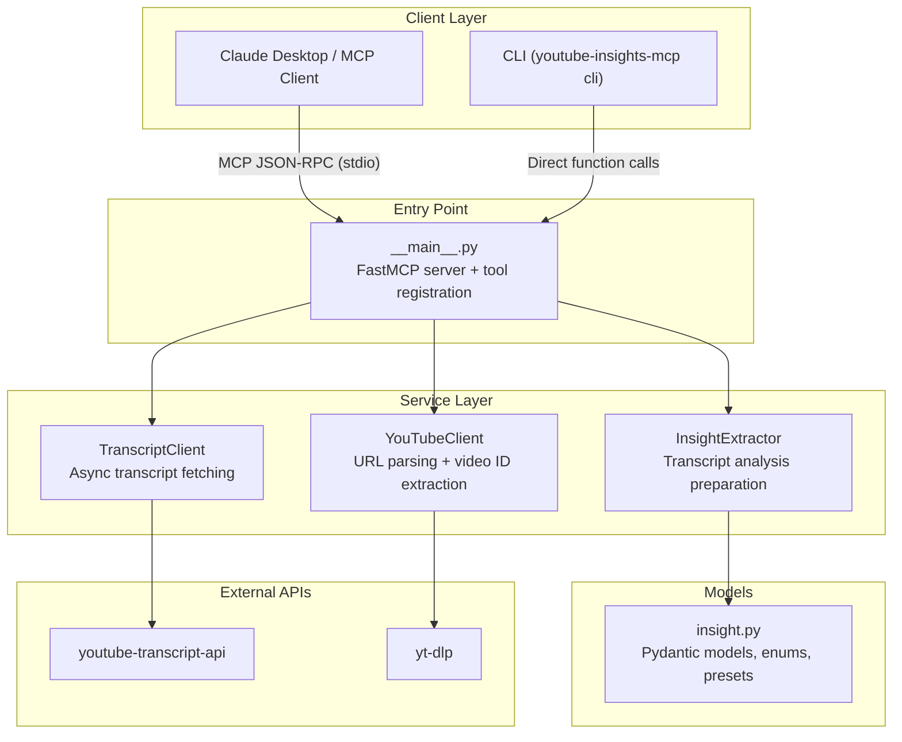

# Architecture

This page describes the project structure, component architecture, and key design patterns used in the YouTube Transcript MCP server.

## Project Structure

```
youtube-transcript-mcp/
├── youtube_insights_mcp/
│   ├── __init__.py
│   ├── __main__.py              # Entry point, MCP tool registration
│   ├── cli.py                   # CLI wrapper for MCP tools
│   ├── models/
│   │   ├── __init__.py
│   │   └── insight.py           # Pydantic models, enums, focus presets
│   └── services/
│       ├── __init__.py
│       ├── transcript_client.py # Transcript fetching with language fallback
│       ├── youtube_client.py    # URL parsing and video ID extraction
│       └── insight_extractor.py # Transcript analysis preparation
├── tests/
│   ├── conftest.py              # Shared fixtures
│   ├── unit/                    # Unit tests
│   └── ...
├── docs/                        # MkDocs documentation (this site)
├── pyproject.toml               # Project config, dependencies, tool settings
└── mkdocs.yml                   # Documentation site configuration
```

## Component Diagram



## Key Patterns

### FastMCP Framework

The server uses [FastMCP](https://github.com/jlowin/fastmcp) — the official high-level framework for building MCP servers in Python. Tools are registered at module level using the `@mcp.tool()` decorator in `__main__.py`.

```python
from mcp.server.fastmcp import FastMCP

mcp = FastMCP(name="youtube-insights-mcp")

@mcp.tool()
async def get_transcript(video_url: str, language: str = "en") -> dict:
    ...
```

!!! warning "No custom Server classes"
    Always use `FastMCP`. Never subclass `mcp.server.Server` directly.

### Module-Level Tool Registration

All 4 MCP tools are registered at the top level of `youtube_insights_mcp/__main__.py`. This ensures they are discovered when the MCP client lists available tools. Tools registered inside functions or conditionally will not be discovered.

### stderr-Only Logging

stdout is reserved exclusively for MCP JSON-RPC protocol messages. **All** logging goes to stderr:

```python
import sys, logging

logging.basicConfig(
    stream=sys.stderr,
    level=logging.INFO,
    format="%(asctime)s - %(name)s - %(levelname)s - %(message)s",
)
```

!!! danger "Never print to stdout"
    Any `print()` call or logging to stdout will corrupt the MCP protocol stream and break communication with the client.

### Async-First Design

All MCP tool handlers are `async` functions. The `TranscriptClient` wraps the synchronous `youtube-transcript-api` library using `asyncio.to_thread()` to avoid blocking the event loop:

```python
async def get_transcript(self, video_id: str, language: str = "en") -> TranscriptResult:
    return await asyncio.to_thread(self._sync_get_transcript, video_id, language)
```

Cancellation is handled correctly — `asyncio.CancelledError` is caught, logged, and re-raised.

### Pydantic Validation

The `youtube_insights_mcp/models/insight.py` module uses Pydantic `BaseModel` for structured data validation:

- `Insight` — a single extracted insight with category, title, summary, confidence
- `KeyQuote` — a notable quote with context
- `InsightExtractionResult` — complete extraction result

Enums (`FocusArea`, `InsightCategory`) define the 6 focus area presets and 24 insight categories.

### String Parameter Conversion

Per MCP convention, all tool parameters arrive as strings. Explicit conversion is performed in each tool handler:

```python
max_insights_int = int(max_insights)  # MCP sends "10" not 10
```

### Structured Error Responses

All tools return structured error dictionaries with `category`, `code`, and `message` fields:

```python
{
    "error": {
        "category": "client_error",
        "code": "INVALID_URL",
        "message": "Could not extract video ID from: ..."
    }
}
```

Error categories: `client_error` (invalid input), `server_error` (internal failure).

## Service Layer

### TranscriptClient

**File**: `youtube_insights_mcp/services/transcript_client.py`

Provides async transcript fetching with a 4-step language fallback strategy:

1. Exact language match
2. Auto-generated version of requested language
3. Any English variant
4. First available transcript

Returns `TranscriptResult` dataclass with segments, full text, and metadata. Defines a custom exception hierarchy: `TranscriptsDisabledError`, `NoTranscriptFoundError`, `VideoUnavailableError`.

### YouTubeClient

**File**: `youtube_insights_mcp/services/youtube_client.py`

Parses YouTube URLs into 11-character video IDs. Supports:

- `https://www.youtube.com/watch?v=VIDEO_ID`
- `https://youtu.be/VIDEO_ID`
- `https://youtube.com/embed/VIDEO_ID`
- `https://m.youtube.com/watch?v=VIDEO_ID`
- Raw video ID strings

### InsightExtractor

**File**: `youtube_insights_mcp/services/insight_extractor.py`

Prepares transcripts for Claude-assisted insight extraction. Does **not** call an LLM directly — instead returns structured prompts and metadata that the Claude host processes conversationally.

Key functions:

- `get_focus_categories()` — resolves focus area names to `InsightCategory` lists
- `build_extraction_prompt()` — generates a structured extraction prompt
- `chunk_transcript()` — splits long transcripts at paragraph boundaries (30k char chunks with 500 char overlap)
- `prepare_for_extraction()` — orchestrates the above into a complete response

## CLI Wrapper

**File**: `youtube_insights_mcp/cli.py`

Provides command-line access to all MCP tools via `youtube-insights-mcp cli <command>`. Outputs JSON to stdout, logs to stderr. Useful for shell scripts, batch processing, and testing without the MCP transport layer.

The entry point in `__main__.py` routes between MCP mode and CLI mode based on `sys.argv`:

```python
if len(sys.argv) > 1 and sys.argv[1] == "cli":
    from youtube_insights_mcp.cli import main as cli_main
    sys.exit(cli_main(sys.argv[2:]))
else:
    mcp.run(transport="stdio")
```
