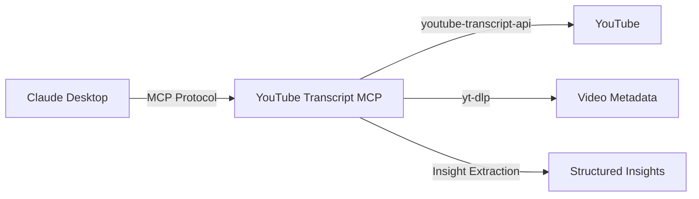

# YouTube Insights MCP

An MCP server for fetching YouTube transcripts and extracting structured insights, designed for use with Claude Desktop and other MCP-compatible clients.

## Features

- **Fetch transcripts** from any YouTube video with intelligent language fallback
- **List available transcripts** to discover languages and transcript types
- **Extract structured insights** using 6 focus area presets (general, entrepreneurial, investment, technical, youtube-channel, ai-learning)
- **Full CLI** for shell and scripting usage
- **MCP protocol compliant** for seamless Claude Desktop integration

## Quick Example

Ask Claude to fetch a transcript:

```
Get the transcript for https://www.youtube.com/watch?v=dQw4w9WgXcQ
```

Or extract insights with a focus area:

```
Extract technical insights from this YouTube video: https://www.youtube.com/watch?v=example
```

## Architecture



## Getting Started

<div class="grid cards" markdown>

- :material-download: **[Installation](getting-started/installation.md)** - Install from source or PyPI
- :material-rocket-launch: **[Quick Start](getting-started/quickstart.md)** - Your first transcript in 5 minutes
- :material-cog: **[Configuration](getting-started/configuration.md)** - Configure Claude Desktop and environment

</div>

## Documentation

| Section | Description |
|---------|-------------|
| [MCP Tools](tools/index.md) | Reference for all 4 MCP tools |
| [CLI Guide](cli/index.md) | Command-line interface usage |
| [Focus Areas](focus-areas/index.md) | Insight extraction presets and customization |
| [Development](development/index.md) | Architecture, contributing, and internals |
| [Troubleshooting](troubleshooting.md) | Common issues and FAQ |
