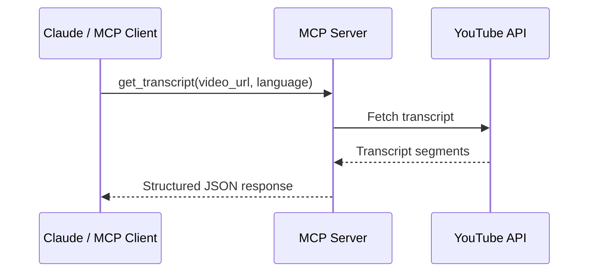

# MCP Tools

YouTube Transcript MCP provides 4 tools accessible via the MCP protocol. Each tool returns structured JSON responses.

## Tool Reference

| Tool | Description | Key Parameters |
|------|-------------|----------------|
| [`get_transcript`](get-transcript.md) | Fetch transcript for a YouTube video with language fallback | `video_url`, `language` |
| [`list_available_transcripts`](list-transcripts.md) | List available transcript languages for a video | `video_url` |
| [`extract_insights`](extract-insights.md) | Prepare transcript for Claude-assisted insight extraction | `transcript`, `focus_areas`, `max_insights` |
| [`list_focus_areas`](list-focus-areas.md) | List all focus area presets and their categories | _(none)_ |

## How It Works

When Claude (or another MCP client) invokes a tool, the server processes the request and returns structured JSON responses. Transcripts are fetched via the `youtube-transcript-api` library with intelligent language fallback.



## Common Workflow

1. **List available transcripts** to see what languages exist:
   ```
   list_available_transcripts(video_url="https://youtube.com/watch?v=VIDEO_ID")
   ```

2. **Fetch the transcript** in your preferred language:
   ```
   get_transcript(video_url="VIDEO_ID", language="en")
   ```

3. **Extract insights** from the transcript text:
   ```
   extract_insights(transcript="<full_text>", focus_areas="technical")
   ```

## Error Handling

All tools return errors in a consistent structured format:

```json
{
  "error": {
    "category": "client_error",
    "code": "ERROR_CODE",
    "message": "Human-readable description"
  }
}
```

Error categories: `client_error` (invalid input) and `server_error` (unexpected failures).
