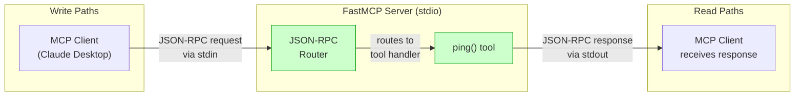
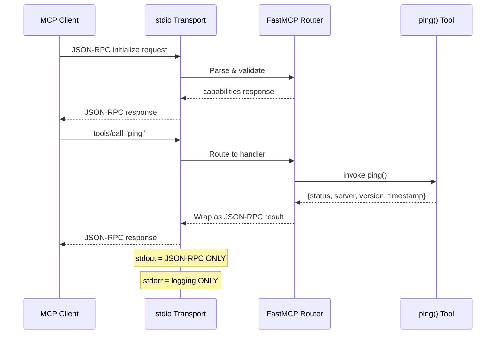
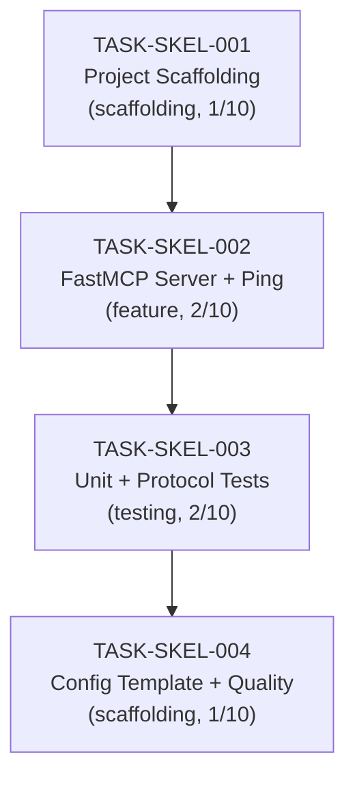

# IMPLEMENTATION GUIDE: FEAT-SKEL-001 Basic FastMCP Server

## Overview

This guide covers the implementation of the foundational MCP server with a `ping` health check tool. All subsequent features build on this walking skeleton.

**Approach**: Official MCP SDK (`mcp` package) with FastMCP
**Execution**: Sequential (4 waves)
**Testing**: Standard (unit tests + protocol test, >80% coverage)

## Data Flow: Read/Write Paths



_All paths are connected. The MCP client sends requests via stdin, FastMCP routes to the ping tool, and responses return via stdout. No disconnected paths._

## Integration Contracts



_The ping tool returns all data through the response chain. No data is fetched and discarded._

## Task Dependencies



_Sequential execution: each task depends on the previous. No parallel opportunities due to tight coupling._

## Execution Plan

### Wave 1: TASK-SKEL-001 - Project Scaffolding
**Mode**: direct | **Complexity**: 1/10

Create:
- `pyproject.toml` with mcp dependency and dev tools
- `src/__init__.py` (empty package marker)
- `tests/unit/` and `tests/protocol/` directories

**Verification**: `pip install -e ".[dev]"` succeeds

### Wave 2: TASK-SKEL-002 - FastMCP Server with Ping Tool
**Mode**: task-work | **Complexity**: 2/10

Create `src/__main__.py` with:
- FastMCP instance (name: `youtube-transcript-mcp`, version: `0.1.0`)
- stderr-only logging
- `ping()` tool with health check response
- stdio transport entry point

**Critical patterns**:
- `from mcp.server.fastmcp import FastMCP` (not standalone fastmcp)
- `logging.basicConfig(stream=sys.stderr)` (not stdout)
- `datetime.now(timezone.utc)` (not `utcnow()`)
- `@mcp.tool()` at module level (not inside functions)

**Verification**: `python -m src` starts without errors

### Wave 3: TASK-SKEL-003 - Unit Tests + Protocol Test
**Mode**: task-work | **Complexity**: 2/10

Create:
- `tests/unit/test_ping.py` - async tests for ping tool
- `tests/protocol/test_mcp_protocol.sh` - JSON-RPC compliance test

**Verification**:
- `pytest tests/unit/ -v` passes
- `pytest tests/ --cov=src --cov-report=term` shows >80% coverage
- `bash tests/protocol/test_mcp_protocol.sh` passes

### Wave 4: TASK-SKEL-004 - Configuration + Quality
**Mode**: direct | **Complexity**: 1/10

Create:
- `.mcp.json.template` with Claude Desktop config

**Verification**:
- `ruff check src/ tests/` passes
- `mypy src/` passes (strict mode)

## File Structure After Implementation

```
youtube-transcript-mcp/
├── src/
│   ├── __init__.py              # Package marker (empty)
│   └── __main__.py              # FastMCP server + ping tool
├── tests/
│   ├── unit/
│   │   └── test_ping.py         # Unit tests for ping
│   └── protocol/
│       └── test_mcp_protocol.sh # MCP protocol compliance test
├── pyproject.toml               # Project configuration
├── .mcp.json.template           # Claude Desktop config template
└── README.md                    # (existing)
```

## Quality Gates

| Check | Command | Threshold |
|-------|---------|-----------|
| Unit tests | `pytest tests/unit/ -v` | All pass |
| Coverage | `pytest tests/ --cov=src` | >80% |
| Protocol test | `bash tests/protocol/test_mcp_protocol.sh` | Pass |
| Linting | `ruff check src/ tests/` | No errors |
| Type checking | `mypy src/` | No errors (strict) |

## Feature Spec Reference

Full specification with code examples: [FEAT-SKEL-001-basic-mcp-server.md](../../../docs/features/FEAT-SKEL-001-basic-mcp-server.md)
