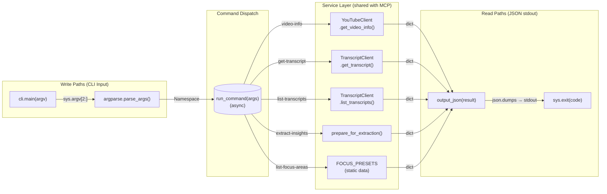
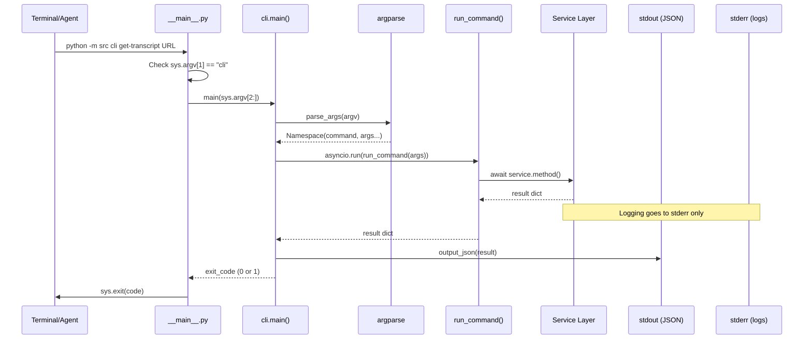
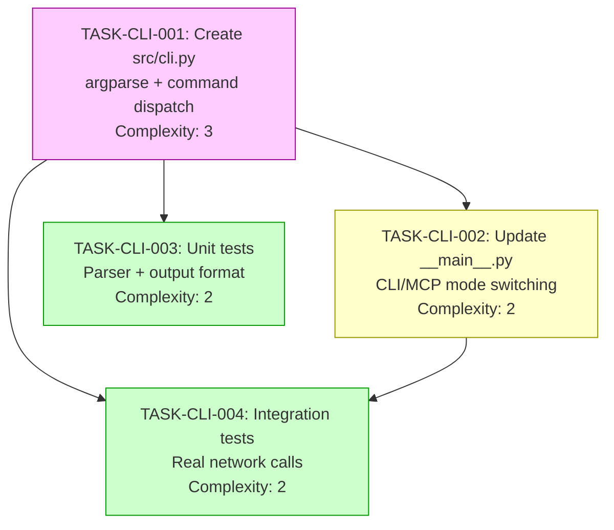

# IMPLEMENTATION-GUIDE: FEAT-CLI-001 CLI Wrapper

**Feature**: CLI wrapper for all MCP tools with JSON stdout output
**Complexity**: 3/10
**Approach**: argparse as specified in FEAT-CLI-001
**Execution**: Sequential (4 waves)
**Testing**: Standard (quality gates)

## Data Flow: Read/Write Paths

_All service calls flow through `run_command()` and exit through `output_json()`. No disconnected paths — every write has a corresponding read._

## Integration Contracts

_Data flows linearly from input to service to JSON output. No data is fetched and discarded._

## Task Dependencies

_T1 is the foundation. T2 and T3 depend on T1. T4 depends on both T1 and T2. Sequential execution recommended due to linear dependencies._

## Execution Strategy

### Wave 1: TASK-CLI-001 — Create CLI Module
- **File**: `src/cli.py`
- **Mode**: task-work
- **Complexity**: 3/10
- **What**: Create argparse parser with all 6 subcommands, `output_json()`, `run_command()` async dispatcher, `main()` entry point
- **Critical constraint**: stdout is JSON only. All logging to stderr.
- **Reference**: Full code in `docs/features/FEAT-CLI-001-cli-wrapper.md`

### Wave 2: TASK-CLI-002 — Update Entry Point
- **File**: `src/__main__.py`
- **Mode**: task-work
- **Complexity**: 2/10
- **What**: Add `if sys.argv[1] == "cli"` check to switch between MCP server and CLI modes
- **Critical constraint**: MCP server behaviour must not change when `cli` arg not present
- **Reference**: Feature spec § "Updated Entry Point"

### Wave 3: TASK-CLI-003 — Unit Tests
- **File**: `tests/unit/test_cli.py`
- **Mode**: task-work
- **Complexity**: 2/10
- **What**: Test parser configuration, default values, flag parsing, JSON output format, exit codes
- **Reference**: Feature spec § "Unit Tests"

### Wave 4: TASK-CLI-004 — Integration Tests
- **File**: `tests/integration/test_cli_integration.py`
- **Mode**: task-work
- **Complexity**: 2/10
- **What**: Test real network calls (get-transcript, video-info) against known YouTube video
- **Marker**: `@pytest.mark.slow` and `@pytest.mark.integration`
- **Reference**: Feature spec § "Integration Test"

## Key Design Decisions

1. **argparse over Click/Typer**: Zero dependencies, stdlib, feature spec provides complete code
2. **Lazy imports in `run_command()`**: Avoids import errors when services aren't yet available
3. **`asyncio.run()` bridge**: CLI is sync entry, services are async — bridge once at top level
4. **Structured error format**: Same `{"error": {"category", "code", "message"}}` as MCP tools

## Pre-requisites

This feature requires these features to be implemented first:
- **FEAT-SKEL-001**: Basic MCP server (project scaffolding, `__main__.py`)
- **FEAT-SKEL-003**: Transcript tools (`TranscriptClient`, `YouTubeClient`)
- **FEAT-INT-001**: Insight extraction (`prepare_for_extraction`, focus area models)

TASK-CLI-001 can be partially implemented without these (parser + ping command), but full command dispatch requires the service layer.

## Quality Gates

- All stdout output must be parseable as JSON
- Exit code 0 for success, 1 for errors
- `ruff check src/cli.py` passes
- `mypy src/cli.py` passes
- Unit tests achieve 100% coverage of parser configuration
- Integration tests pass against known YouTube video
