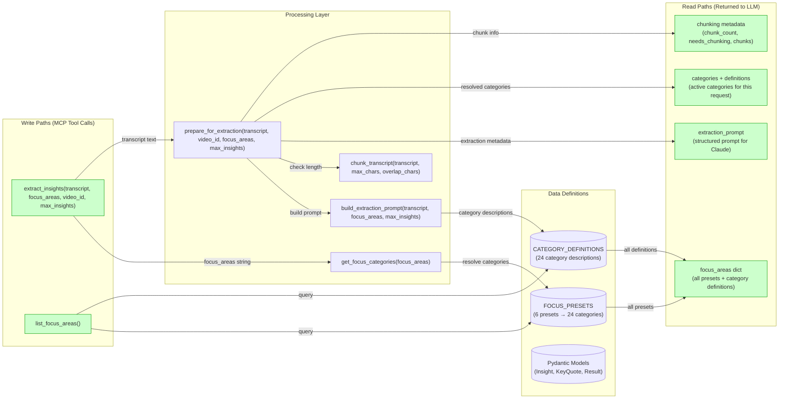
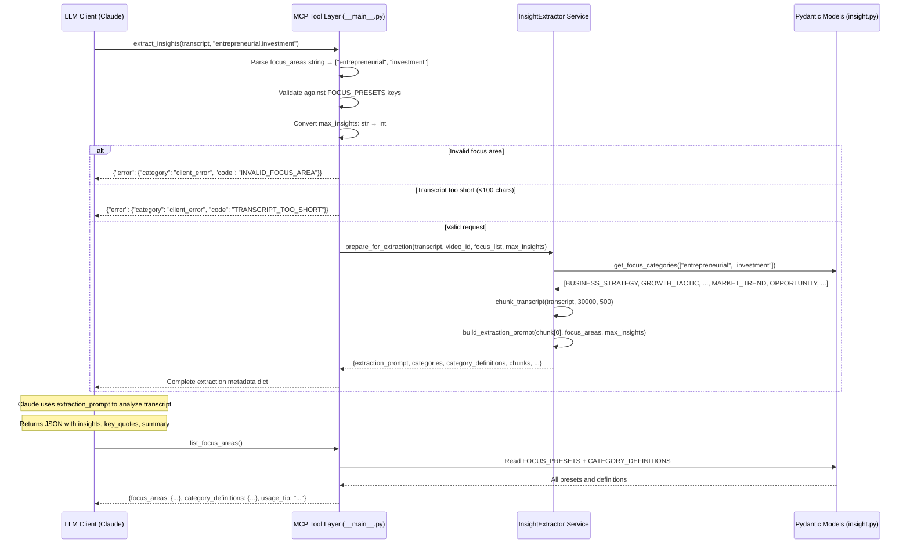
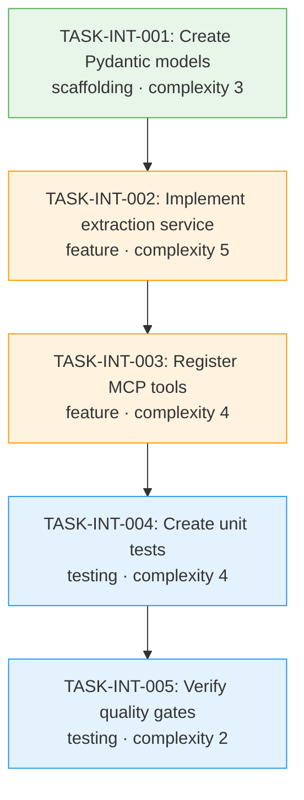

# IMPLEMENTATION GUIDE: FEAT-INT-001 Insight Extraction

## Overview

**Feature**: Add `extract_insights` and `list_focus_areas` MCP tools with 6 focus presets
**Complexity**: 6/10
**Estimated Time**: 4-5 hours
**Dependencies**: FEAT-SKEL-003 (Transcript Tool), pydantic>=2.0
**Approach**: Direct spec implementation (Option 1)
**Execution**: Sequential (5 waves)
**Testing**: Standard (>80% coverage, ruff, mypy)

## Data Flow: Read/Write Paths



_All write paths have corresponding read paths. No disconnections detected. The `extraction_prompt` is the primary output — it's a self-contained prompt that Claude (or any LLM) can use to extract insights from the transcript._

## Integration Contract Diagram



_Data flows completely from LLM request through tool layer to service and models, and back. The extraction_prompt is returned to the LLM for analysis — no data is fetched and discarded._

## Task Dependencies



_Sequential execution — each wave depends on the previous. Green = scaffolding, Orange = feature, Blue = testing._

## §4: Integration Contracts

### Contract: insight_models

- **Producer task:** TASK-INT-001
- **Consumer task(s):** TASK-INT-002, TASK-INT-003
- **Artifact type:** Python module (importable)
- **Format constraint:** All models and constants must be importable from `src.models.insight`:
  - `FocusArea` (Enum with 6 values)
  - `InsightCategory` (Enum with 24 values)
  - `Insight`, `KeyQuote`, `InsightExtractionResult` (Pydantic BaseModel)
  - `FOCUS_PRESETS` (dict[str, list[InsightCategory]])
  - `CATEGORY_DEFINITIONS` (dict[InsightCategory, str])
- **Validation method:** Coach verifies `from src.models.insight import FocusArea, InsightCategory, FOCUS_PRESETS, CATEGORY_DEFINITIONS` succeeds and `len(FOCUS_PRESETS) == 6`.

### Contract: extraction_service

- **Producer task:** TASK-INT-002
- **Consumer task(s):** TASK-INT-003
- **Artifact type:** Python module (importable)
- **Format constraint:** Three functions must be importable from `src.services.insight_extractor`:
  - `get_focus_categories(focus_areas: list[str]) -> list[InsightCategory]`
  - `build_extraction_prompt(transcript: str, focus_areas: list[str], max_insights: int) -> str`
  - `chunk_transcript(transcript: str, max_chars: int, overlap_chars: int) -> list[str]`
  - `prepare_for_extraction(transcript: str, video_id: Optional[str], focus_areas: Optional[list[str]], max_insights: int) -> dict`
- **Validation method:** Coach verifies `from src.services.insight_extractor import prepare_for_extraction, get_focus_categories` succeeds.

## Execution Strategy

### Wave 1: TASK-INT-001 — Create Pydantic Models (45 min)

- Create `src/models/__init__.py` and `src/models/insight.py`
- Define `FocusArea` enum (6 values), `InsightCategory` enum (24 values)
- Define `Insight`, `KeyQuote`, `InsightExtractionResult` Pydantic models
- Define `FOCUS_PRESETS` and `CATEGORY_DEFINITIONS` mappings
- **Gate**: All models importable, ruff + mypy pass

### Wave 2: TASK-INT-002 — Implement Extraction Service (90 min)

- Create `src/services/insight_extractor.py`
- Implement `get_focus_categories()` — resolve focus areas to categories
- Implement `build_extraction_prompt()` — structured prompt with categories and guidelines
- Implement `chunk_transcript()` — paragraph-boundary splitting with overlap
- Implement `prepare_for_extraction()` — orchestrates all above, returns extraction metadata
- **Gate**: All functions return expected structures, ruff + mypy pass

### Wave 3: TASK-INT-003 — Register MCP Tools (60 min)

- Add imports to `src/__main__.py`
- Register `extract_insights` tool with parameter validation
- Register `list_focus_areas` tool
- Handle string→int conversion for `max_insights`
- Implement structured error responses
- **Gate**: Both tools discoverable, structured errors work, ruff + mypy pass

### Wave 4: TASK-INT-004 — Create Unit Tests (60 min)

- Create `tests/unit/test_insights.py`
- Test all 6 focus presets and 24 category definitions
- Test `get_focus_categories` edge cases
- Test chunking with various transcript lengths
- Test prompt building includes correct elements
- Test `prepare_for_extraction` metadata structure
- Test Pydantic model validation (valid/invalid)
- **Gate**: All tests pass, >80% coverage

### Wave 5: TASK-INT-005 — Verify Quality Gates (30 min)

- `ruff check src/ tests/` — zero errors
- `mypy src/` — zero errors
- `pytest tests/ -v` — all pass
- `pytest tests/ --cov=src` — >80% coverage
- No regressions in existing tests
- **Gate**: All quality checks pass

## Key Patterns Applied

| # | Pattern | Application in FEAT-INT-001 |
|---|---------|------------------------------|
| 1 | Module-level tools | `@mcp.tool()` for both tools in `__main__.py` |
| 2 | stderr logging | `logging.getLogger(__name__)` in insight_extractor.py |
| 3 | String parameters | `max_insights` arrives as `"10"` → convert to `int(max_insights)` |
| 4 | Structured errors | `{"error": {"category": "client_error", "code": "INVALID_FOCUS_AREA"}}` |
| 5 | Pydantic validation | `Field(ge=0.0, le=1.0)` for confidence, `Field(max_length=100)` for title |
| 6 | Claude-assisted | Return prompt + metadata, not embedded LLM results |

## File Structure After Implementation

```
src/
├── __init__.py
├── __main__.py              # + extract_insights, list_focus_areas
├── models/
│   ├── __init__.py          # NEW
│   └── insight.py           # NEW: Pydantic models + presets + definitions
└── services/
    ├── __init__.py
    ├── youtube_client.py    # From FEAT-SKEL-002
    ├── transcript_client.py # From FEAT-SKEL-003
    └── insight_extractor.py # NEW: extraction service

tests/
└── unit/
    ├── test_ping.py         # From FEAT-SKEL-001
    ├── test_video_info.py   # From FEAT-SKEL-002
    ├── test_transcript.py   # From FEAT-SKEL-003
    └── test_insights.py     # NEW: insight extraction tests

pyproject.toml               # + pydantic>=2.0 dependency
```

## Quality Gates

| Check | Command | Threshold |
|-------|---------|-----------|
| Linting | `ruff check src/ tests/` | Zero errors |
| Type checking | `mypy src/` | Zero errors |
| Unit tests | `pytest tests/ -v` | All pass |
| Coverage | `pytest tests/ --cov=src` | >80% |
| Model coverage | `pytest --cov=src/models/insight.py` | >90% |
| Service coverage | `pytest --cov=src/services/insight_extractor.py` | >90% |

## Definition of Done

- [ ] `src/models/insight.py` defines all Pydantic models and 6 presets
- [ ] `src/services/insight_extractor.py` implements extraction prep with chunking
- [ ] `extract_insights` tool registered in `__main__.py`
- [ ] `list_focus_areas` tool provides discovery for all 6 presets
- [ ] Chunking works for long transcripts (>30K chars)
- [ ] Focus area validation with helpful errors
- [ ] All 24 categories have definitions
- [ ] youtube-channel preset includes: channel_strategy, content_idea, audience_growth, production_tip
- [ ] ai-learning preset includes: ai_concept, ai_tool, mental_model, practical_application
- [ ] Unit tests pass with >80% coverage
- [ ] Code passes `ruff check` and `mypy`
