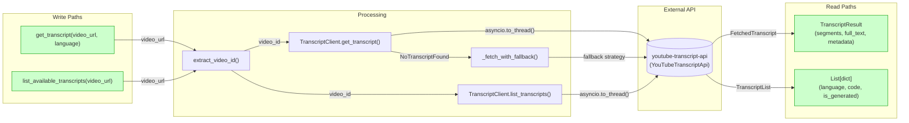
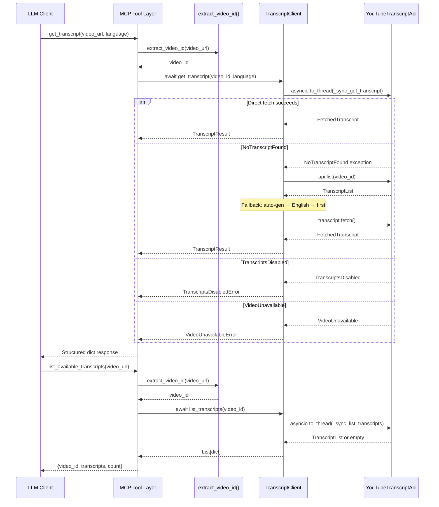
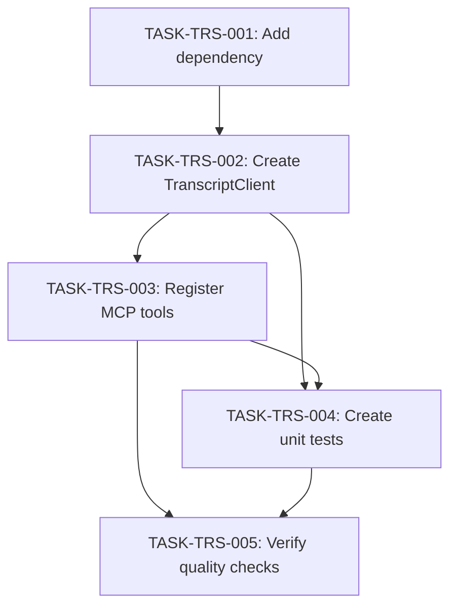

# IMPLEMENTATION GUIDE: FEAT-SKEL-003 Transcript Fetching Tools

## Overview

**Feature**: Add `get_transcript` and `list_available_transcripts` MCP tools
**Complexity**: 5/10
**Estimated Time**: 4-5 hours
**Dependencies**: FEAT-SKEL-001 (Basic MCP Server), FEAT-SKEL-002 (Video Info Tool — reuses `extract_video_id`)
**Approach**: Direct feature spec implementation (Option 1)
**Execution**: Sequential (5 waves)
**Testing**: Standard (>80% coverage, ruff, mypy)

## Data Flow: Read/Write Paths



_All write paths have corresponding read paths. No disconnections detected._

## Integration Contracts



_Data flows completely from LLM request through all layers to API and back. No data is fetched and discarded._

## Task Dependencies



_Sequential execution — each wave depends on the previous. No parallel-safe tasks identified._

## §4: Integration Contracts

### Contract: TranscriptClient

- **Producer task:** TASK-TRS-002
- **Consumer task(s):** TASK-TRS-003
- **Artifact type:** Python class (importable module)
- **Format constraint:** `TranscriptClient` must be importable from `src.services.transcript_client` and instantiable at module level with no constructor arguments. Must expose `async get_transcript(video_id: str, language: str) -> TranscriptResult` and `async list_transcripts(video_id: str) -> list[dict]`.
- **Validation method:** Coach verifies `from src.services.transcript_client import TranscriptClient` succeeds and `TranscriptClient()` instantiates without error.

### Contract: extract_video_id

- **Producer task:** FEAT-SKEL-002 / TASK-VID-002 (external dependency)
- **Consumer task(s):** TASK-TRS-003
- **Artifact type:** Python function (importable)
- **Format constraint:** `extract_video_id(url: str) -> str` must be importable from `src.services.youtube_client`. Must raise `InvalidURLError` for invalid URLs.
- **Validation method:** Coach verifies `from src.services.youtube_client import extract_video_id, InvalidURLError` succeeds.

### Contract: Custom Exceptions

- **Producer task:** TASK-TRS-002
- **Consumer task(s):** TASK-TRS-003, TASK-TRS-004
- **Artifact type:** Python exception classes
- **Format constraint:** `TranscriptsDisabledError`, `NoTranscriptFoundError`, `VideoUnavailableError` must be importable from `src.services.transcript_client`. `NoTranscriptFoundError` must have `available_languages: list[str]` attribute.
- **Validation method:** Coach verifies all three exceptions are importable and `NoTranscriptFoundError` accepts `available_languages` kwarg.

## Execution Strategy

### Wave 1: TASK-TRS-001 — Add Dependency (10 min)
- Add `youtube-transcript-api>=1.0.0` to pyproject.toml
- Verify import works
- **Gate**: `pip install -e ".[dev]"` succeeds

### Wave 2: TASK-TRS-002 — Create TranscriptClient (90 min)
- Create `src/services/transcript_client.py`
- Implement dataclasses, exceptions, client class
- Language fallback strategy
- **Gate**: Module imports successfully, ruff + mypy pass

### Wave 3: TASK-TRS-003 — Register MCP Tools (60 min)
- Add `get_transcript` and `list_available_transcripts` to `__main__.py`
- Wire up TranscriptClient at module level
- Structured error responses
- **Gate**: Tools discoverable, ruff + mypy pass

### Wave 4: TASK-TRS-004 — Create Unit Tests (60 min)
- Create `tests/unit/test_transcript.py`
- Mock youtube-transcript-api responses
- Cover happy path, fallback, error cases
- **Gate**: All tests pass, >80% coverage on transcript_client.py

### Wave 5: TASK-TRS-005 — Verify Quality (30 min)
- Full quality gate sweep
- MCP Inspector verification
- Regression check on existing tests
- **Gate**: Zero ruff errors, zero mypy errors, >80% overall coverage

## Key Patterns Applied

| # | Pattern | Application in FEAT-SKEL-003 |
|---|---------|------------------------------|
| 1 | Module-level tools | `@mcp.tool()` for both tools in `__main__.py` |
| 2 | stderr logging | `logging.getLogger(__name__)` in transcript_client.py |
| 3 | CancelledError | Catch, log, re-raise in `get_transcript()` and `list_transcripts()` |
| 4 | String parameters | `language` param arrives as string (already string type) |
| 5 | Async wrappers | `asyncio.to_thread()` for all sync API calls |
| 6 | Structured errors | `{"error": {"category": "...", "code": "...", "message": "..."}}` |
| 7 | Service layer | `TranscriptClient` class separates business logic from tool handlers |

## File Structure After Implementation

```
src/
├── __init__.py
├── __main__.py              # + get_transcript, list_available_transcripts
└── services/
    ├── __init__.py
    ├── youtube_client.py    # From FEAT-SKEL-002 (reuses extract_video_id)
    └── transcript_client.py # NEW: TranscriptClient service

tests/
└── unit/
    ├── test_ping.py         # From FEAT-SKEL-001
    ├── test_video_info.py   # From FEAT-SKEL-002
    └── test_transcript.py   # NEW: transcript tests

pyproject.toml               # + youtube-transcript-api dependency
```

## Quality Gates

| Check | Command | Threshold |
|-------|---------|-----------|
| Linting | `ruff check src/ tests/` | Zero errors |
| Type checking | `mypy src/` | Zero errors |
| Unit tests | `pytest tests/ -v` | All pass |
| Coverage | `pytest tests/ --cov=src` | >80% |
| Regression | `pytest tests/unit/test_ping.py tests/unit/test_video_info.py` | All pass |

## Definition of Done

- [ ] `src/services/transcript_client.py` implements TranscriptClient with fallback
- [ ] `get_transcript` tool registered in `__main__.py`
- [ ] `list_available_transcripts` tool registered in `__main__.py`
- [ ] Language fallback strategy: requested -> auto-generated -> English -> first
- [ ] Structured errors for disabled/unavailable transcripts
- [ ] Unit tests pass with mocked API (>80% coverage)
- [ ] `pyproject.toml` includes youtube-transcript-api
- [ ] Both tools visible in MCP Inspector
- [ ] Code passes `ruff check` and `mypy`
- [ ] No regressions in existing tests
