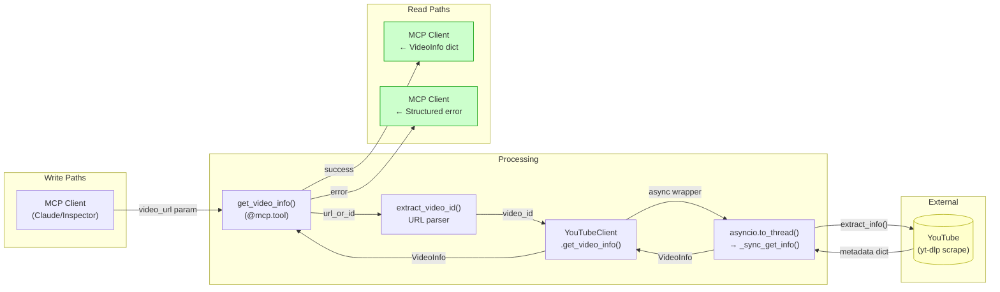
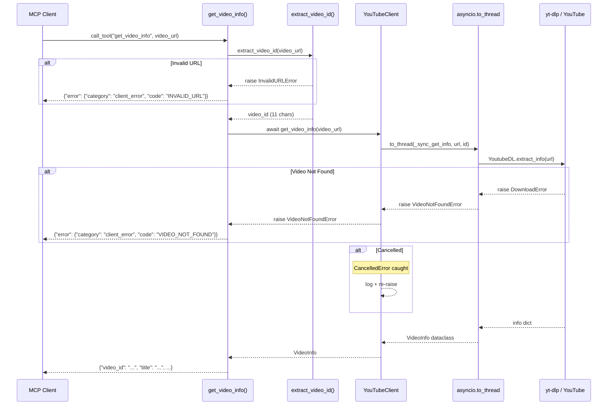
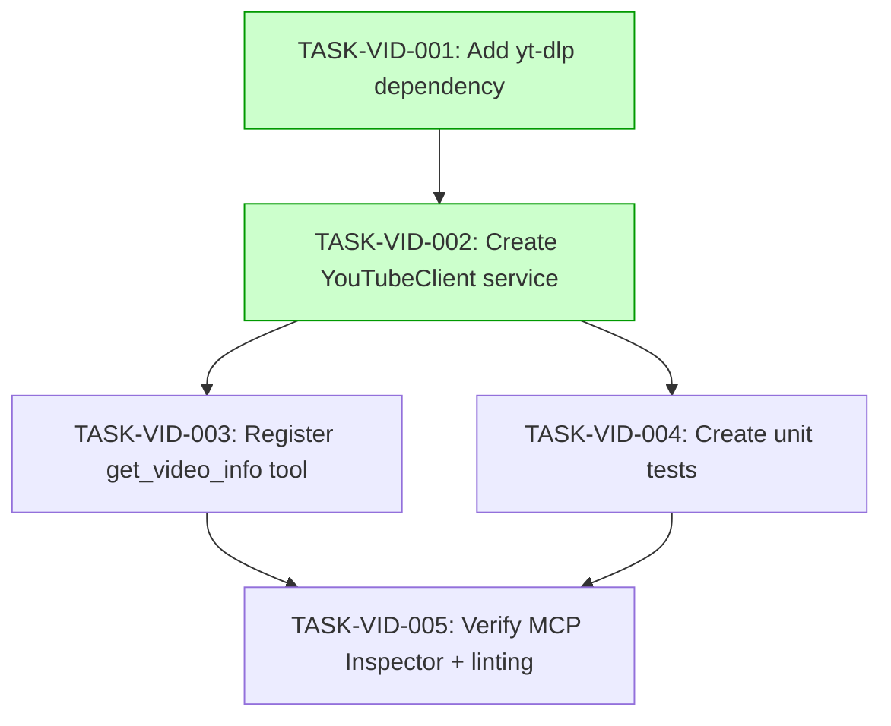

# Implementation Guide: FEAT-SKEL-002 Video Info Tool

## Overview

Implement the `get_video_info` MCP tool using yt-dlp to fetch YouTube video metadata. This builds on FEAT-SKEL-001 (basic server) by adding external library integration, a service layer, async wrappers, and structured error handling.

**Approach**: Option 1 — Direct yt-dlp integration with YouTubeClient service layer
**Testing**: Standard (quality gates: unit tests, linting, type checking)
**Feature Spec**: `docs/features/FEAT-SKEL-002-video-info-tool.md`

---

## Data Flow: Read/Write Paths

_All write paths (input) have corresponding read paths (output). No disconnections detected._

---

## Integration Contracts

_Shows complete request lifecycle including all error paths. No data is fetched and discarded._

---

## Task Dependencies

_Tasks with green background are in Wave 1 and can start first. Wave 2 tasks (TASK-VID-003, TASK-VID-004) can run in parallel after Wave 1 completes._

---

## §4: Integration Contracts

### Contract: YouTubeClient
- **Producer task:** TASK-VID-002
- **Consumer task(s):** TASK-VID-003
- **Artifact type:** Python module import
- **Format constraint:** `from src.services.youtube_client import YouTubeClient, VideoNotFoundError, InvalidURLError` must resolve. `YouTubeClient` must have async method `get_video_info(url_or_id: str) -> VideoInfo`.
- **Validation method:** Import check — verify `YouTubeClient`, `VideoNotFoundError`, `InvalidURLError` are importable from `src.services.youtube_client`

---

## Execution Strategy

### Wave 1 (Foundation)
| Task | Mode | Description |
|------|------|-------------|
| TASK-VID-001 | direct | Add yt-dlp to pyproject.toml |
| TASK-VID-002 | task-work | Create YouTubeClient service layer |

TASK-VID-001 is trivial and should be completed first. TASK-VID-002 depends on it (needs yt-dlp installed).

### Wave 2 (Integration + Testing)
| Task | Mode | Description |
|------|------|-------------|
| TASK-VID-003 | task-work | Register tool in __main__.py |
| TASK-VID-004 | task-work | Create unit tests |

These can run in parallel — TASK-VID-003 modifies `__main__.py`, TASK-VID-004 creates a new test file. No file conflicts.

### Wave 3 (Verification)
| Task | Mode | Description |
|------|------|-------------|
| TASK-VID-005 | direct | Run linting, type checking, MCP Inspector |

Final verification after all code is in place.

---

## Key MCP Patterns Applied

| Pattern | Applied In | Details |
|---------|-----------|---------|
| stderr logging | youtube_client.py | `logger = logging.getLogger(__name__)` |
| Module-level tools | __main__.py | `@mcp.tool()` at module level |
| String parameters | get_video_info | `video_url: str` parameter |
| Async wrappers | YouTubeClient | `asyncio.to_thread()` for sync yt-dlp |
| CancelledError | YouTubeClient | Catch, log, re-raise |
| Structured errors | get_video_info | Category/code/message pattern |

---

## Prerequisite

**FEAT-SKEL-001 must be implemented first.** This feature requires:
- `src/__main__.py` with FastMCP server and `mcp` instance
- `src/__init__.py` package marker
- `pyproject.toml` with base dependencies
- Working test infrastructure (`pytest`, `pytest-asyncio`)

---

## Files Created/Modified

| File | Action | Task |
|------|--------|------|
| `pyproject.toml` | Modified | TASK-VID-001 |
| `src/services/__init__.py` | Created | TASK-VID-002 |
| `src/services/youtube_client.py` | Created | TASK-VID-002 |
| `src/__main__.py` | Modified | TASK-VID-003 |
| `tests/unit/test_video_info.py` | Created | TASK-VID-004 |
